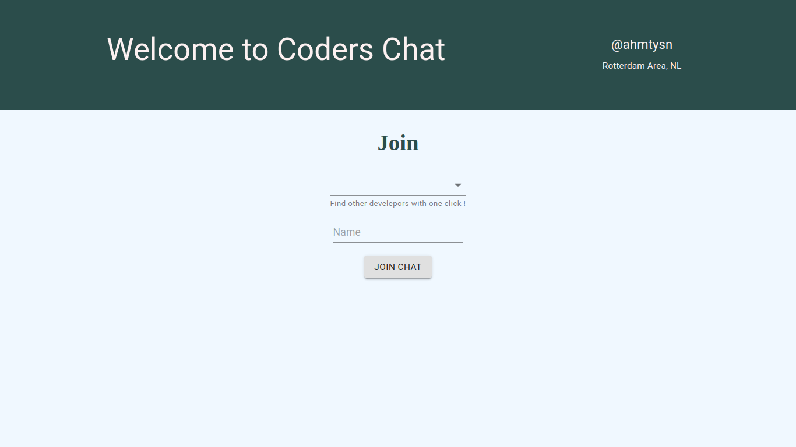
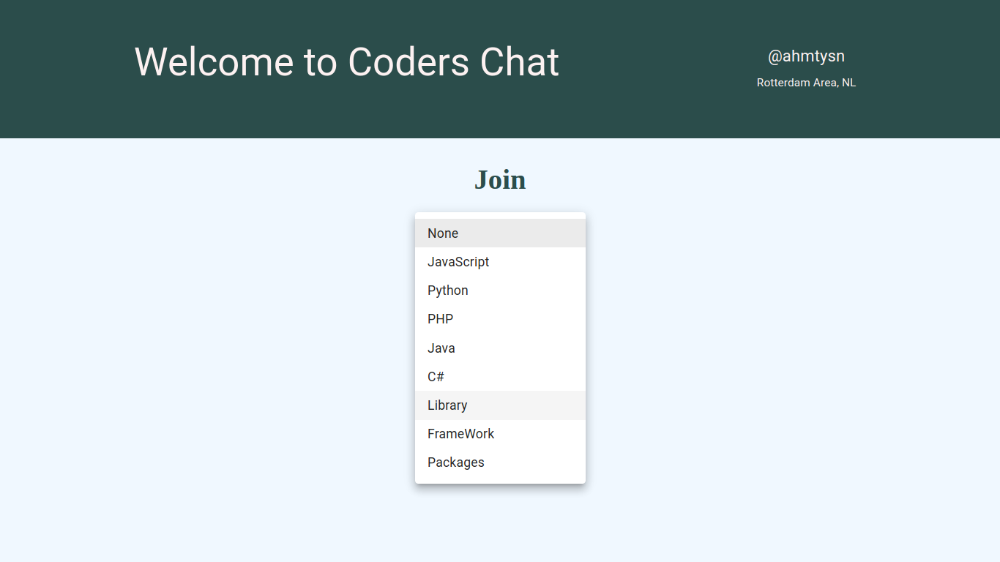
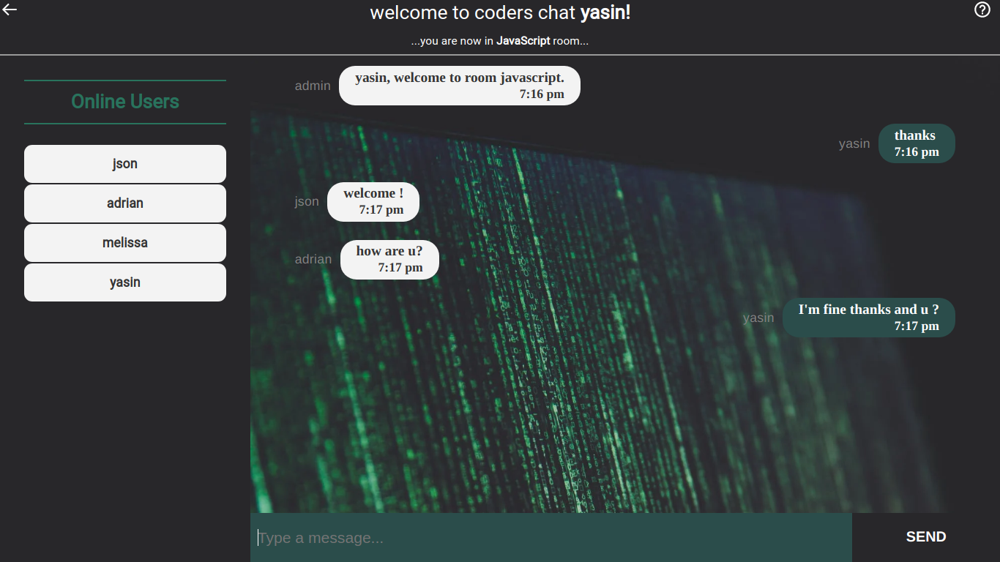

# Realtime Chat Application

### [Live Site](https://5fa1a7e81c1e7c0093456132--loving-engelbart-ad9d28.netlify.app/)

## Introduction

This is a code repository for the corresponding video tutorial.

In this video, we will create a full Realtime Chat Application. We're going to use React on the front end, with NodeJS + Socket.io web socket library on the back end.

By the end of this video, you will have a strong understanding of how to send and receive messages using web sockets and Socket.io to make any real-time application.

Setup:

```
- run `npm i && npm start` for both client and server side to start the development server
```

  
  
  
